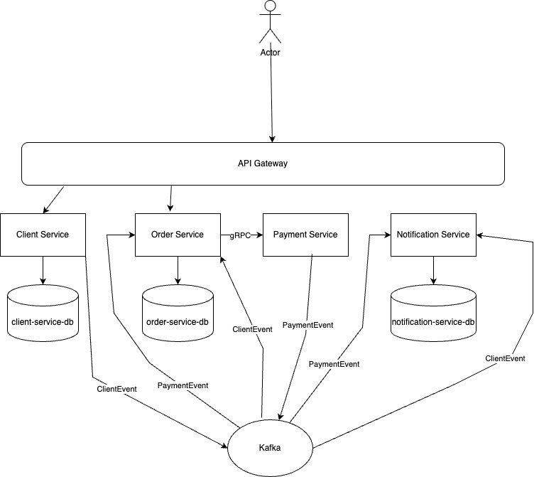

# Payment Microservice

## Overview

This project demonstrates a modern and resilient microservices architecture using **Spring Boot**, **Gradle**, and **Apache Kafka**
as the event backbone. It follows best practices for scalability, decoupling, and observability with a
didactic purpose.

---

## Architecture

- **Independent Microservices:** Each service is responsible for a specific domain (e.g., Client, Order, Payment).
- **Isolated Databases:** Each microservice maintains its own SQL database (_Database per Service_).
- **Synchronous and Asynchronous Communication:**
    - REST using Spring Web.
    - gRPC for high-performance internal communication.
    - Kafka for event-driven communication.
- **Shared Library:** A common Gradle library with Kafka utilities, validations, and custom exceptions.



---

## Event-Driven Architecture

- **Apache Kafka** as the event backbone.
- **Producers and Consumers** with `KafkaTemplate` and `@KafkaListener`.
- Full support for:
    - **Dead Letter Queue (DLQ)** for failed messages.
    - **Configurable retries** with fallback using Resilience4j.
    - **Idempotency** in consumers to avoid reprocessing.
- **Events propagate state changes** between services, reducing coupling and increasing scalability.

---

## Best Practices Followed

- Clear separation between domains, layers, and responsibilities.
- Retry and Fallback with **Resilience4j**.
- **Unit, integration, and E2E tests** with significant coverage.
- Observability using:
    - **Zipkin** (distributed tracing).
    - **Prometheus + Grafana** (metrics and dashboards).
- Docker containers orchestrated via `docker compose`.
- CI with **GitHub Actions** — build, E2E tests, and push on the `main` branch.
- **Eureka** for service discovery.
- Global validations and standardized exception handling.
- Environment profiles (`application-docker.yml`, `application-dev.yml`, etc).

---

## Project Structure

```
payment-microservice/
├── api-gateway/           # API Gateway — Spring Cloud Gateway
├── client-service/        # Client microservice
├── notification-service/  # Notification microservice (SendGrid)
├── order-service/         # Order microservice
├── payment-service/       # Payment microservice (gRPC server)
├── service-registry/      # Eureka Server
├── shared-lib/            # Common shared library
├── e2e-tests/             # End-to-end tests (full stack)
├── docker-compose.yml     # Full stack with observability tools
└── docker-compose-e2e.yml # Lightweight stack for E2E tests
```

---

## Testing Strategy

The project follows the **test pyramid** with three layers:

```
        /\
       /E2E\          <- full stack via Docker Compose
      /------\
     /  Integ  \      <- per service, with TestContainers (Kafka, gRPC)
    /------------\
   /  Unit Tests  \   <- isolated, per class/method
  /----------------\
```

### Unit Tests

- Location: `src/test/java` in each service
- Tools: JUnit 5, Mockito, AssertJ
- Run: `./gradlew test`

### Integration Tests

- Location: `src/integration/java` in each service
- Tools: TestContainers (Kafka), Spring Boot Test
- Run: `./gradlew integrationTest`

### End-to-End Tests (E2E)

- Location: `e2e-tests/`
- Tools: REST Assured, Awaitility, Docker Compose
- The full stack is started automatically before the tests and shut down after

**What is tested:**

| Scenario                                   | Endpoint                 |
|--------------------------------------------|--------------------------|
| Create client                              | `POST /client`           |
| Fetch client by ID                         | `GET /client/{id}`       |
| Update client                              | `PUT /client/{id}`       |
| Create order (starts as `PENDING_PAYMENT`) | `POST /order`            |
| Payment processed asynchronously via Kafka | `GET /order/client/{id}` |
| Final status matches payment-service logic | `GET /order/client/{id}` |
| List all orders for a client               | `GET /order/client/{id}` |
| Validation and 404 scenarios               | Various                  |

**Important:** the `order-service` maintains its own client database populated via Kafka events.
The E2E tests account for this by waiting for the Kafka event to be consumed before placing an order.

**Run E2E tests locally:**

```bash
# Images must be available locally (build or pull first)
./gradlew :e2e-tests:test
```

> The regular `./gradlew build` does **not** run E2E tests — they are executed as a dedicated step in CI.

---

## How to Run Locally

1. **Clone the repository:**
   ```bash
   git clone https://github.com/jorgeeduardo96/payment-microservice.git
   cd payment-microservice
   ```

2. **Build the modules:**
   ```bash
   ./gradlew clean build
   ```

3. **Start the services using Docker Compose:**
   ```bash
   docker compose up
   ```

4. **Access the services:**

| Service     | URL                                   |
|-------------|---------------------------------------|
| API Gateway | http://localhost:8080                 |
| Eureka      | http://localhost:8761                 |
| Kafka UI    | http://localhost:8085                 |
| Zipkin      | http://localhost:9411                 |
| Grafana     | http://localhost:3000 (admin / admin) |
| Prometheus  | http://localhost:9091                 |

---

## CI/CD Pipeline

The GitHub Actions workflow runs on every push or pull request to `main`:

```
Build all services (unit + integration tests)
        |
        v
Build Docker images (local)
        |
        v
Run E2E tests
        |
        v
Push Docker images to Docker Hub (only if all tests pass)
```
