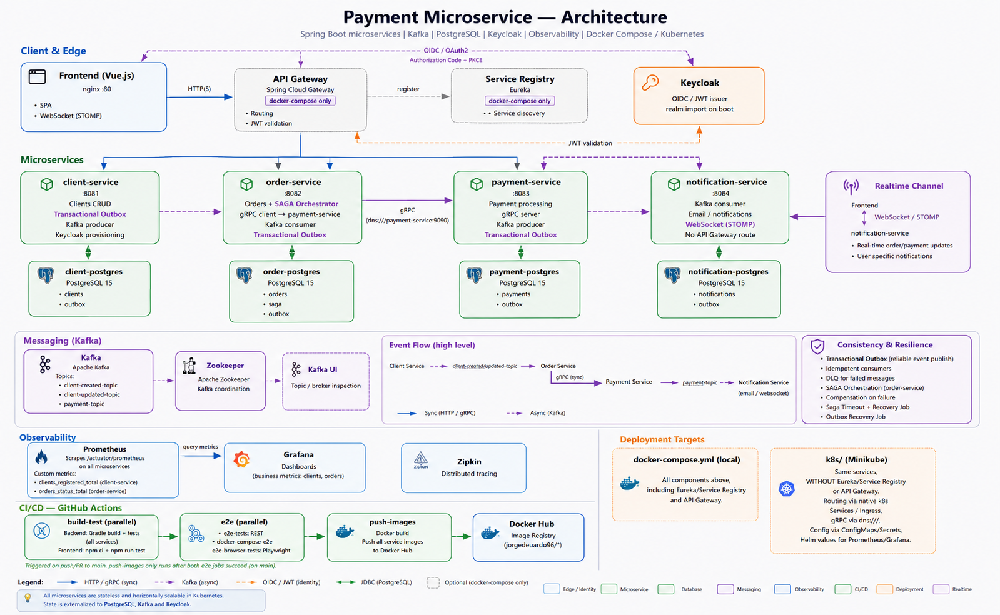

# Payment Microservice

## Overview

This project demonstrates a modern and resilient microservices architecture using **Spring Boot**, **Gradle**, **Apache Kafka**
as the event backbone, **WebSocket (STOMP)** for real-time, push-based communication with the frontend, and **Keycloak**
for authentication/authorization. It follows best practices for scalability, decoupling, and observability with a
didactic purpose.

---

## Architecture

- **Independent Microservices:** Each service is responsible for a specific domain (e.g., Client, Order, Payment).
- **Isolated Databases:** Each microservice maintains its own SQL database (_Database per Service_).
- **Synchronous and Asynchronous Communication:**
    - REST using Spring Web.
    - gRPC for high-performance internal communication.
    - Kafka for event-driven communication.
    - WebSocket (STOMP) for real-time notifications pushed to the frontend.
- **Authentication & Authorization:** Keycloak issues JWTs (Authorization Code + PKCE from the browser); the API Gateway
  validates every request and enforces role-based access (see [Authentication & Authorization](#authentication--authorization)).
- **Shared Library:** A common Gradle library with Kafka utilities, validations, and custom exceptions.



---

## Event-Driven Architecture

- **Apache Kafka** as the event backbone.
- **Producers and Consumers** with `KafkaTemplate` and `@KafkaListener`.
- Full support for:
    - **Transactional Outbox Pattern** in `client-service` and `payment-service` — see details below.
    - **Orchestrated SAGA Pattern** coordinating the order → payment distributed transaction in `order-service` — see
      details below.
    - **Dead Letter Queue (DLQ)** for failed messages (consumer-side, complementary to the outbox).
    - **Configurable retries** with fallback using Resilience4j.
    - **Idempotency** in consumers to avoid reprocessing.
- **Events propagate state changes** between services, reducing coupling and increasing scalability.

---

## Transactional Outbox Pattern

`client-service` and `payment-service` both persist a domain change and the corresponding Kafka event **in the same local
database transaction**, instead of writing to the database and publishing to Kafka as two separate, non-atomic steps.

### The problem it solves

Without an outbox, a service typically does:

```
1. save entity to DB           (commit)
2. publish event to Kafka      (separate, unrelated operation)
```

If the process crashes — or Kafka is unreachable — between steps 1 and 2, the database and the event stream permanently
diverge: the state change happened, but nothing downstream ever finds out (or, in the opposite ordering, an event is
published for a change that never actually got committed). This is the classic **dual-write problem**.

### How it works here

1. The business write (e.g. inserting a `Client` or a `Payment`) and an `outbox` row describing the event to be published
   are persisted **in the same `@Transactional` method**, so they either both commit or both roll back together.
2. Once that transaction **commits**, a `@TransactionalEventListener(phase = AFTER_COMMIT)` fires and hands the new
   outbox row's id to an `OutboxPublisher`, which sends it to Kafka and marks it `PUBLISHED` (or `FAILED`, with the
   error recorded, if Kafka itself is unreachable at that moment).
3. A scheduled `OutboxRecoveryJob` periodically re-publishes any `PENDING`/`FAILED` outbox rows older than a short grace
   period — this is what makes the pattern resilient to Kafka being down at decision-time: the event is never lost,
   only delayed, because it was durably persisted before anything ever touched Kafka.

### The `outbox` table

| Column           | Purpose                                                                                          |
|------------------|---------------------------------------------------------------------------------------------------|
| `id`             | Outbox row identity; also what the `AFTER_COMMIT` listener/publisher key off of.                  |
| `aggregate_type` | The kind of entity the event is about (e.g. `Client`, `Payment`) — useful for tracing/auditing.    |
| `aggregate_id`   | The id of that entity, so a given event can be traced back to the record that caused it.           |
| `event_type`     | Which topic/decision this row maps to (e.g. `client-created`, `payment-processed`).                |
| `payload`        | The serialized event body actually sent to Kafka — captured at decision time, not recomputed later.|
| `status`         | `PENDING` → `PROCESSING` → `PUBLISHED`, or `FAILED` if Kafka rejected/timed out the send.           |
| `attempts`       | How many times a (re)publish was attempted — visibility into flaky sends.                          |
| `last_error`     | The last failure message, for troubleshooting without needing to dig through logs.                 |
| `created_at`     | Drives the recovery job's "older than N seconds" retry query.                                      |
| `published_at`   | Set once the send actually succeeds — an audit trail of when the event really left the building.   |

### Why `payment-service` needed more than just an outbox table

`payment-service` used to be **entirely stateless**: a gRPC call came in, a `PAID`/`FAILED` decision was computed on the
spot, and it was published to Kafka directly — nothing was ever persisted. That meant:

- **No idempotency** — a retried gRPC call (e.g. after a client-side timeout) could re-decide and re-publish the same
  payment twice.
- **Silently lost decisions** — if the Kafka send failed, the exception was only logged; the order stayed stuck in
  `PENDING_PAYMENT` forever with zero record that a decision had ever been made.

Since the outbox pattern requires *something transactional to piggyback on*, adding it here meant introducing a real
`payment` table first, with `order_id` as a **unique, database-enforced idempotency key** — not just an in-app check,
since two concurrent requests for the same order could both pass an application-level lookup before either commits.
The DB-level unique constraint (and the `DataIntegrityViolationException` it triggers) is the real safety net for that
race. The now-durable decision is published via the same outbox mechanism described above.

### DLQ and outbox are complementary, not redundant

The outbox pattern addresses **producer-side** reliability (never losing a decision once it's made). The existing
**Dead Letter Queue** (`DeadLetterPublishingRecoverer`) addresses a different, **consumer-side** failure mode: a
message that was published successfully but that a *consumer* repeatedly fails to process (e.g. a poison-pill payload
or a transient downstream error). Both mechanisms stay in place, each covering a different half of the pipeline.

---

## SAGA Pattern (Order → Payment Orchestration)

Creating an order and charging for it spans two services (`order-service` and `payment-service`) with no distributed
transaction tying them together. `order-service` implements an **orchestrated SAGA** to make that multi-step,
multi-service process explicit, trackable, and — most importantly — **self-recovering** when something goes wrong
partway through.

### The problem it solves

Without a saga, the order → payment flow relied on the choreography between services working out on its own:
`order-service` calls `payment-service` via gRPC, which asynchronously publishes the result to Kafka, which
`order-service` consumes to update the order's final status. If the gRPC call failed, the Kafka event was lost, or
`order-service` was down when the event arrived, there was **no mechanism tracking that anything had gone wrong** —
the order would simply stay in `PENDING_PAYMENT` forever, with no compensating action ever taking place.

### How it works here

1. **`order_saga` table**: tracks the distributed transaction's own state — `STARTED` → `PAYMENT_REQUESTED` →
   `COMPLETED`/`COMPENSATED`/`FAILED` — separately from `OrderStatus`, which reflects what the customer sees
   (`PENDING_PAYMENT`/`PAID`/`FAILED`). The saga row is created **atomically with the order**, in the same
   `@Transactional` method, so an order can never exist without a saga tracking it.
2. **State transitions at every step of the flow**:
    - Right before the gRPC call to `payment-service` → `PAYMENT_REQUESTED`.
    - The Kafka `payment-topic` event is consumed → `COMPLETED` (payment `PAID`) or `COMPENSATED` (payment
      `FAILED`), matching the order status update transactionally.
    - The gRPC call itself fails after Resilience4j's retries are exhausted → the order is cancelled and the saga
      is marked `COMPENSATED` by the `@Retry` fallback method.
3. **`OrderSagaTimeoutJob`** — the piece that actually closes the "stuck forever" gap: a `@Scheduled` job that
   periodically looks for sagas that have been sitting in `PAYMENT_REQUESTED` for longer than a configurable timeout
   (e.g. the Kafka event never arrived) and **compensates them automatically** — cancelling the order instead of
   leaving it pending indefinitely. If the compensation itself fails (e.g. the database is temporarily unreachable),
   the saga's retry count is incremented until a configurable maximum, at which point it's marked `FAILED` — a
   terminal state signalling that manual intervention is needed, instead of being retried forever.

```
createOrder()  ──►  STARTED  ──►  PAYMENT_REQUESTED  ──┬──►  COMPLETED     (payment PAID via Kafka)
                                                        ├──►  COMPENSATED  (payment FAILED via Kafka, or gRPC
                                                        │                   retries exhausted, or timeout job fired)
                                                        └──►  FAILED       (compensation itself kept failing)
```

### Why orchestration, not choreography

The saga is **orchestrated** by `order-service` (it owns the saga state and drives every transition) rather than
**choreographed** (each service reacting independently to events with no central view). With only two services
involved, choreography would have worked for the happy path, but it offers no natural place to put a timeout/recovery
mechanism — there's no single owner responsible for noticing "this transaction never finished." Orchestration gives
the saga state machine a home (`order-service`) and, with it, a natural place for `OrderSagaTimeoutJob` to live.

### Configuration

```yaml
order-service:
  saga:
    timeout-minutes: 5          # how long a saga can sit in PAYMENT_REQUESTED before being compensated
    check-interval-ms: 60000    # how often the timeout job scans for stuck sagas
    max-compensation-retries: 3 # attempts before a saga is marked FAILED instead of retried forever
```

---

## Authentication & Authorization

**Keycloak** (`keycloak/realm-export.json`) is the identity provider for the whole platform. The frontend logs in via the
standard **Authorization Code + PKCE** flow; the API Gateway validates the resulting JWT on every request and maps
Keycloak's `realm_access.roles` claim into Spring Security authorities.

**Realm roles:**

| Role     | Who                                                          | Access                                                                                              |
|----------|---------------------------------------------------------------|------------------------------------------------------------------------------------------------------|
| `ADMIN`  | Staff managing the platform                                  | Full access, including client registration (`POST`/`PUT /client`) and the admin notification feed   |
| `USER`   | Regular staff (read-only)                                    | Can read clients/orders, cannot register/edit clients                                                |
| `CLIENT` | A registered customer (see below)                             | Can only see and receive real-time updates about their own orders                                    |

**Client registration also provisions a login.** When a client is registered (`POST /client`), `client-service` also creates
a matching Keycloak user (role `CLIENT`, default password `client123`, username = the client's email) via a dedicated
`client-service` service account scoped only to `manage-users`/`view-realm` on this realm — never the realm superadmin.
The client's business-entity id is stored as a custom `clientId` user attribute and surfaced in the JWT via a protocol
mapper, so the frontend and `notification-service` can tell which Client a logged-in user corresponds to.

**Real-time notifications are role-aware, not one-size-fits-all:**

- `ADMIN` sessions connect to a broadcast topic (`/topic/notifications`) and get notified when a new client registers.
- `CLIENT` sessions are bound to their own STOMP session (via the `clientId` claim) and are notified individually
  (`/user/queue/notifications`) when their order's payment is confirmed or fails — never broadcast to anyone else.
- `notification-service`'s `StompAuthChannelInterceptor` enforces this at the STOMP `CONNECT` frame itself, since the
  Gateway can only see the initial HTTP upgrade request, not the STOMP-level `Authorization` header sent afterward.

**Payment processing** is decided (`PAID`/`FAILED`) and durably persisted (`payment-service`) before being published to
Kafka via the transactional outbox pattern (see [Transactional Outbox Pattern](#transactional-outbox-pattern) below) —
`order-service` updates the order's status from that event, and `notification-service` pushes the WebSocket update plus
(for `PAID`) a confirmation email via SendGrid.

---

## Internationalization (i18n)

The frontend supports **English, Portuguese, and Spanish** via `vue-i18n`.

- Translation keys live in `frontend/src/locales/{en,pt,es}.json`, mirrored 1:1 across the three files.
- All view/component templates (`App.vue`, `HomeView`, `ClientsView`, `OrdersView`, `CallbackView`, `NotificationBell`,
  route titles) render text through `t()`/`$t()` — no hardcoded UI strings.
- A language switcher (globe icon in the app bar) lets the user change locale at runtime; the choice is persisted to
  `localStorage` and restored on reload. English is the default when nothing is stored.
- Locale-sensitive formatting (e.g. notification timestamps) follows the active locale instead of a fixed one.

---

## Best Practices Followed

- Clear separation between domains, layers, and responsibilities.
- **Transactional Outbox Pattern** (`client-service`, `payment-service`) for reliable event publishing — see
  [Transactional Outbox Pattern](#transactional-outbox-pattern).
- **Orchestrated SAGA Pattern** (`order-service`) coordinating the order → payment distributed transaction, with
  automatic compensation on timeout/failure — see [SAGA Pattern](#saga-pattern-order--payment-orchestration).
- Retry and Fallback with **Resilience4j**.
- **Unit, integration, and E2E tests** with significant coverage.
- Observability using:
    - **Zipkin** (distributed tracing).
    - **Prometheus + Grafana** (metrics and dashboards).
- Docker containers orchestrated via `docker compose`.
- Also deployable to **Kubernetes** (Minikube) without Eureka/API Gateway — see [Kubernetes (Minikube)](#kubernetes-minikube).
- CI with **GitHub Actions** — build, E2E tests, and push on the `main` branch.
- **Eureka** for service discovery.
- Global validations and standardized exception handling.
- Environment profiles (`application-docker.yml`, `application-dev.yml`, etc).

---

## Project Structure

```
payment-microservice/
├── api-gateway/           # API Gateway — Spring Cloud Gateway (JWT validation, routing)
├── client-service/        # Client microservice (also provisions Keycloak logins)
├── notification-service/  # Notification microservice (SendGrid + WebSocket/STOMP)
├── order-service/         # Order microservice
├── payment-service/       # Payment microservice (gRPC server)
├── service-registry/      # Eureka Server
├── shared-lib/            # Common shared library
├── frontend/              # Vue 3 + Vuetify SPA
├── keycloak/              # Realm exports (roles, clients, seed users)
├── e2e-tests/             # End-to-end tests (REST API, full stack)
├── e2e-browser-tests/     # End-to-end tests (real browser via Playwright, full stack)
├── docker-compose.yml     # Full stack with observability tools
├── docker-compose-e2e.yml # Lightweight stack (incl. frontend) for both E2E modules
└── k8s/                   # Kubernetes manifests/Helm values (Minikube) — see Kubernetes section below
```

---

## Testing Strategy

The project follows the **test pyramid** with three layers:

```
        /\
       /E2E\          <- full stack via Docker Compose
      /------\
     /  Integ  \      <- per service, with TestContainers (Kafka, gRPC)
    /------------\
   /  Unit Tests  \   <- isolated, per class/method
  /----------------\
```

### Unit Tests

- Location: `src/test/java` in each service
- Tools: JUnit 5, Mockito, AssertJ
- Run: `./gradlew test`

### Integration Tests

- Location: `src/integration/java` in each service
- Tools: TestContainers (Kafka), Spring Boot Test
- Run: `./gradlew integrationTest`

### End-to-End Tests (E2E)

- Location: `e2e-tests/`
- Tools: REST Assured, Awaitility, Docker Compose
- The full stack — including a Keycloak instance seeded from `keycloak/realm-export-e2e.json` — is started automatically
  before the tests and shut down after
- `BaseE2ETest` fetches a real `admin` access token from Keycloak once and attaches it to every request by default
  (via `RestAssured.requestSpecification`), so most test classes don't need to know anything about auth. The `frontend`
  client only has direct (password) grants enabled in this test realm — the real app never uses that flow.

**What is tested:**

| Scenario                                          | Endpoint                 |
|----------------------------------------------------|--------------------------|
| Create client                                      | `POST /client`           |
| Fetch client by ID                                 | `GET /client/{id}`       |
| Update client                                      | `PUT /client/{id}`       |
| Create order (starts as `PENDING_PAYMENT`)         | `POST /order`            |
| Payment processed asynchronously via Kafka         | `GET /order/client/{id}` |
| Final status matches payment-service logic         | `GET /order/client/{id}` |
| List all orders for a client                       | `GET /order/client/{id}` |
| Validation and 404 scenarios                       | Various                  |
| Request without a token is rejected (401)          | `POST /client`           |
| Non-admin (`USER`) can't register clients (403)    | `POST /client`           |
| Non-admin can still read clients (200)             | `GET /client`            |

**Important:** the `order-service` maintains its own client database populated via Kafka events.
The E2E tests account for this by waiting for the Kafka event to be consumed before placing an order.

**Run E2E tests locally:**

```bash
# Images must be available locally (build or pull first)
./gradlew :e2e-tests:test
```

> The regular `./gradlew build` does **not** run E2E tests — they are executed as a dedicated step in CI.

### Browser E2E Tests (Playwright, Java)

- Location: `e2e-browser-tests/`
- Tools: Playwright for Java, JUnit 5, Docker Compose
- Unlike `e2e-tests` (which drives the REST API directly and authenticates via ROPC), this module
  drives a real Chromium browser against the actual frontend, going through the real
  **Authorization Code + PKCE** login flow — navigating to the app, filling Keycloak's hosted
  login form, and asserting on what a user actually sees.
- The full stack — including a `frontend` container — is started from `docker-compose-e2e.yml`
  automatically before the tests and shut down after, the same way `e2e-tests` does.

**What is tested:**

| Scenario                                                                  |
|-----------------------------------------------------------------------------|
| Login/logout through the real Keycloak hosted login page                 |
| `ADMIN` sees the full navigation (Clients, Orders); `USER`/`CLIENT` don't see the Clients nav item and are blocked (with a warning toast) if they navigate to `/clients` directly |
| `ADMIN` creates and edits a client through the UI                        |
| `ADMIN`'s notification bell receives a "client created" notification in real time |
| A `CLIENT` places an order through the UI and sees its status flip from *Pending Payment* to *Paid*/*Failed* **without a manual refresh**, driven entirely by the WebSocket push |
| That same `CLIENT` receives their own payment confirmation/failure notification in real time |

**Run browser E2E tests locally:**

```bash
# Images must be available locally (build or pull first)
./gradlew :e2e-browser-tests:test

# To watch the browser instead of running headless:
./gradlew :e2e-browser-tests:test -Dheadless=false
```

> Like `e2e-tests`, this module is excluded from `./gradlew build` and runs as a dedicated CI step,
> after the Docker images are built.

**Watching the tests run (`-Dheadless=false`) on Windows:** Playwright's bundled Chromium requires
the Microsoft Visual C++ Redistributable (x64) to launch on Windows; without it, the browser fails
to start with a "side-by-side configuration" error. `BaseBrowserE2ETest` detects Windows and falls
back to launching the system's installed Microsoft Edge instead (`channel: "msedge"`, same Chromium
engine underneath) so the suite works out of the box — you'll see an Edge window, not Chromium.
Installing the VC++ Redistributable lets Playwright's own Chromium run instead, if preferred.
CI (Linux) always uses the bundled Chromium.

### Frontend Tests

- Location: `frontend/src/**/__test__`
- Tools: Vitest, Vue Test Utils, @pinia/testing
- Coverage: stores, API layer, components, and views
- Run: `npm run test` (inside `frontend/`)

---

## How to Run Locally

1. **Clone the repository:**
   ```bash
   git clone https://github.com/jorgeeduardo96/payment-microservice.git
   cd payment-microservice
   ```

2. **Build the modules:**
   ```bash
   ./gradlew clean build
   ```

3. **Start the services using Docker Compose:**
   ```bash
   docker compose up
   ```

4. **Access the services:**

| Service     | URL                                   |
|-------------|----------------------------------------|
| Frontend    | http://localhost:8000                   |
| API Gateway | http://localhost:8080                   |
| Keycloak    | http://localhost:8180 (admin / admin)   |
| Eureka      | http://localhost:8761                   |
| Kafka UI    | http://localhost:8085                   |
| Zipkin      | http://localhost:9411                   |
| Grafana     | http://localhost:3000 (admin / admin)   |
| Prometheus  | http://localhost:9091                   |

5. **Log in to the frontend** with one of the seeded users (see `keycloak/realm-export.json`):

| Username | Password    | Role(s)       |
|----------|-------------|---------------|
| `admin`  | `admin123`  | `ADMIN`, `USER` |
| `demo`   | `demo123`   | `USER`        |

   Registering a client from the app (as `admin`) also creates a matching Keycloak login for that client
   (username = the client's email, password `client123`, role `CLIENT`).

---

## Kubernetes (Minikube)

In addition to `docker compose`, the full stack can also run on a local **Kubernetes** cluster (tested with
**Minikube**), under `k8s/`. This deployment intentionally drops two pieces of infrastructure that only make sense in a
Docker-Compose-style, service-discovery-less network:

- **No Eureka / service-registry** — Kubernetes' own Service DNS (`<service-name>.<namespace>.svc.cluster.local`)
  replaces client-side service discovery. Each service's `application-k8s.yml` profile points directly at the other
  services' Kubernetes Service names instead of registering with Eureka.
- **No API Gateway** — each backend service now validates JWTs **itself** (via its own Spring Security
  `SecurityConfig`, resource-server style) instead of relying on the gateway to do it centrally. `notification-service`
  already did this at the STOMP `CONNECT` frame; `client-service` and `order-service` gained their own `SecurityConfig`
  for this migration. The frontend's `nginx` calls each service's Kubernetes Service directly (see
  `k8s/frontend/nginx-configmap.yaml`) instead of going through `api-gateway:8080`.

### Structure

```
k8s/
├── postgres/                # One Bitnami Helm values file per service's own Postgres instance (Database per Service)
├── kafka/                   # Bitnami Kafka Helm values
├── kafka-ui/                # Kafka UI Deployment/Service (NodePort)
├── keycloak/                # Keycloak Deployment/Service/ConfigMap (realm import)
├── zipkin/                  # Zipkin Deployment/Service
├── prometheus/              # Prometheus Helm values
├── grafana/                 # Grafana Helm values
├── client-service/           # Deployment/Service (NodePort) — has its own SecurityConfig
├── order-service/            # Deployment/Service (NodePort) — has its own SecurityConfig, gRPC client uses dns:///
├── payment-service/          # Deployment/Service (ClusterIP-only — no HTTP API, gRPC + Kafka only)
├── notification-service/     # Deployment/Service (NodePort — direct WebSocket access, no gateway to proxy it)
└── frontend/                 # Deployment/Service (NodePort) + ConfigMap overriding nginx's routing for in-cluster DNS
```

### Key differences from `docker-compose.yml`

- Each service has its own `application-k8s.yml` Spring profile (Postgres/Kafka Service DNS names, Eureka disabled).
- `order-service`'s gRPC client to `payment-service` uses the `dns:///payment-service:9090` URI scheme, **not**
  `static://` — the latter only accepts literal IPs and does not resolve hostnames, which breaks against Kubernetes
  Service DNS names.
- The frontend's `nginx.conf` is unchanged (still bakes in the `api-gateway`-based routing used by `docker compose`,
  so the same Docker image serves both environments). Its Kubernetes-specific routing (direct calls to
  `client-service`, `order-service`, `notification-service`, no gateway) lives in a `ConfigMap`
  (`k8s/frontend/nginx-configmap.yaml`) mounted over `/etc/nginx/conf.d/default.conf` at runtime.
  - `nginx`'s `resolver` directive does **not** honor `/etc/resolv.conf`'s `search` domains the way a normal libc
    resolver does, so the ConfigMap uses fully-qualified Service names
    (e.g. `client-service.default.svc.cluster.local`) rather than short names.

### Running it

```bash
minikube start

# Build and load each service's image (repeat per service, bump the tag on every rebuild,
# e.g. :v1 -> :v2, instead of reusing a tag — `minikube image load` doesn't reliably
# refresh a cached image under an unchanged tag):
./gradlew :client-service:build -x test -x integrationTest
docker build -t payment-microservice-client-service:v1 client-service/
minikube image load payment-microservice-client-service:v1
# ...repeat for order-service, payment-service, notification-service, frontend

# Apply infra first (Postgres instances, Kafka, Keycloak, Zipkin, Prometheus/Grafana, Kafka UI),
# then the application services, then the frontend:
kubectl apply -f k8s/postgres/ -f k8s/kafka/ -f k8s/keycloak/ -f k8s/zipkin/ \
              -f k8s/prometheus/ -f k8s/grafana/ -f k8s/kafka-ui/
kubectl apply -f k8s/client-service/ -f k8s/order-service/ -f k8s/payment-service/ \
              -f k8s/notification-service/
kubectl apply -f k8s/frontend/nginx-configmap.yaml -f k8s/frontend/deployment.yaml -f k8s/frontend/service.yaml
```

Minikube's Docker driver doesn't expose `NodePort`s on the host directly — reach each service with
`kubectl port-forward`:

| Service      | Command                                     | URL                     |
|--------------|----------------------------------------------|-------------------------|
| Frontend     | `kubectl port-forward svc/frontend 8000:80`   | http://localhost:8000   |
| Keycloak     | `kubectl port-forward svc/keycloak 8180:8080` | http://localhost:8180   |
| Kafka UI     | `kubectl port-forward svc/kafka-ui 8085:8080` | http://localhost:8085   |
| Grafana      | `kubectl port-forward svc/grafana 3000:80`    | http://localhost:3000   |

`client-service`, `order-service`, and `notification-service` can also be port-forwarded individually for direct
API/WebSocket testing, but normally the frontend is the single entry point a browser needs.

---

## CI/CD Pipeline

The GitHub Actions workflow runs on every push or pull request to `main`:

```
Build all services (unit + integration tests)
        |
        v
Run frontend tests
        |
        v
Build Docker images (local)
        |
        v
Run E2E tests (REST API)
        |
        v
Run Browser E2E tests (Playwright)
        |
        v
Push Docker images to Docker Hub (only if all tests pass)
```
